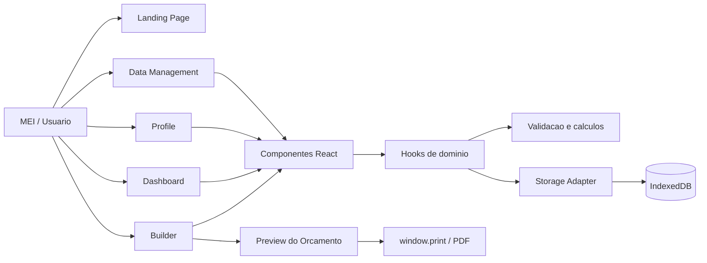
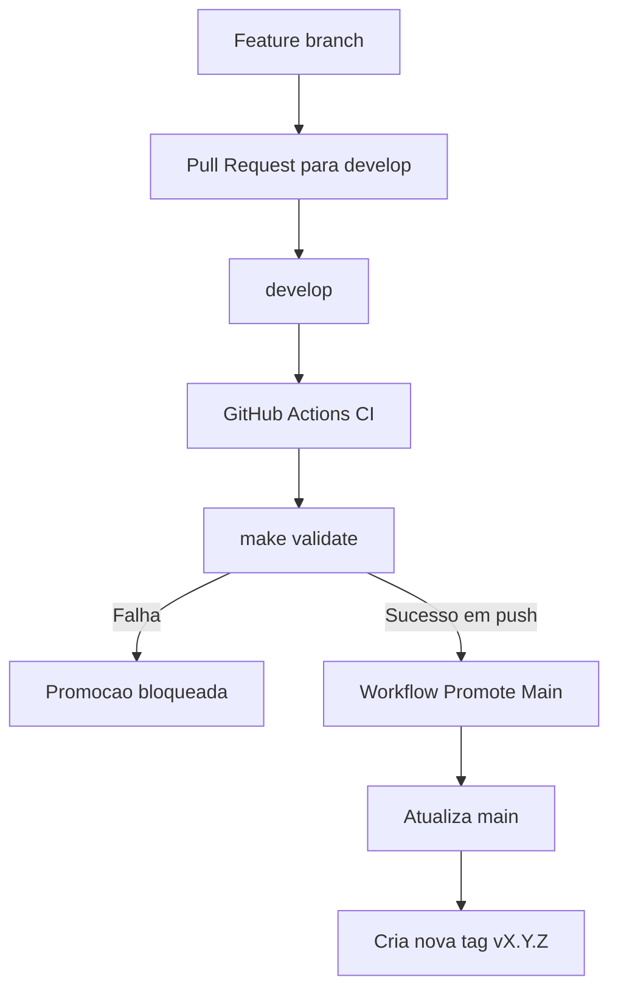
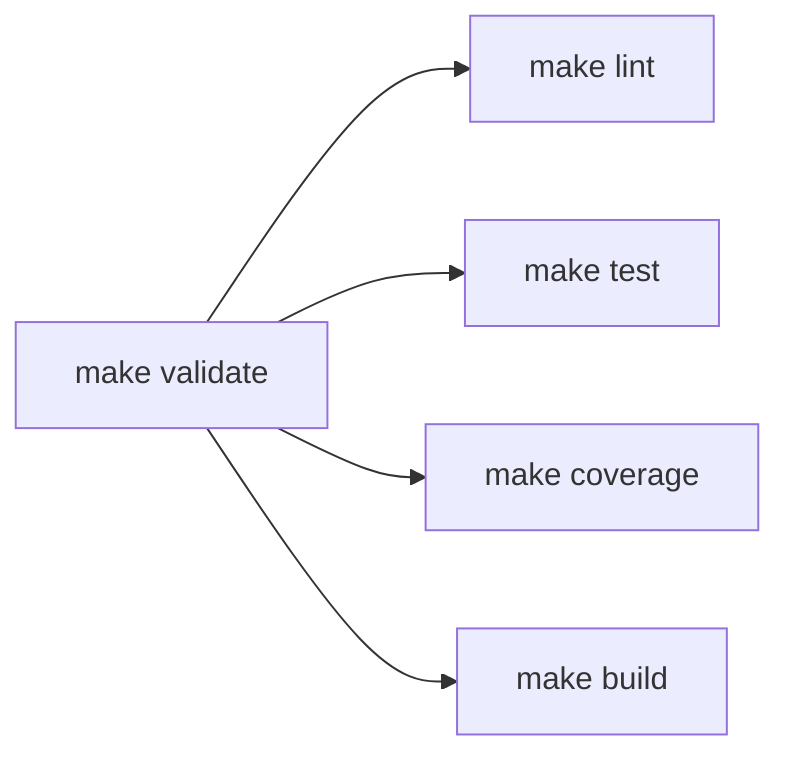

# Diagramas do Projeto

## Arquitetura Funcional

## Fluxo de Validacao e Release

## Pipeline do Makefile

## Regra Operacional

- `develop` e a branch de integracao.
- `make validate` e a porta de qualidade local e remota.
- `main` deve refletir apenas commit aprovado em `develop`.
- Cada promocao automatica deve gerar `tag +1` no padrao `patch`.
