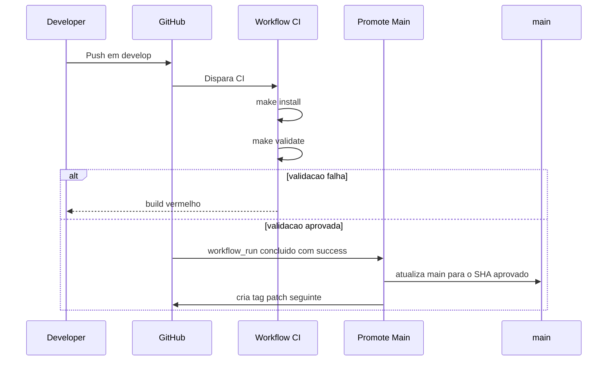

# Fluxo de Release

## Objetivo

Garantir que a `main` receba apenas commits aprovados no pipeline de validacao da `develop`.

## Sequencia Esperada

1. O trabalho entra por branch de feature.
2. A feature abre PR para `develop`.
3. O workflow `CI` roda em `pull_request` e em `push` para `develop`.
4. O `CI` executa `make install` e `make validate`.
5. Se o `push` em `develop` terminar com sucesso, o workflow `Promote Main` atualiza a `main`.
6. Na mesma promocao, a automacao cria a proxima tag semantica no formato `vX.Y.Z`.

## Diagrama de Sequencia

## Observacao

Se voce der `push` na `develop`, o comportamento esperado e:

- testar;
- validar;
- se passar, promover para `main`;
- criar `tag +1`.

Isso depende de duas condicoes no GitHub:

- a action ter permissao para atualizar a `main`;
- o workflow `Promote Main` estar presente na branch padrao.
